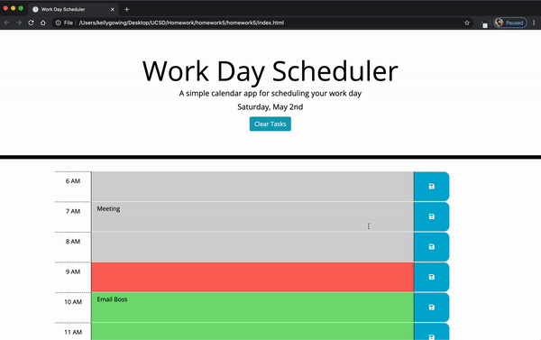

# 05 Third-Party APIs: Work Day Scheduler

This is a simple calendar application that allows the user to save events for each hour of the day. This app will run in the browser and feature dynamically updated HTML and CSS powered by jQuery.

This project has utalized the [Moment.js](https://momentjs.com/) library to work with date and time. 

This project has been completed with no known bugs and can be viewed [here](https://kelly70ve.github.io/PlannerApp/). The project is responsive and can be viewed on mobile, tablet or desktop.

---

## Project Goals

- when the planner is openedthe current day is displayed at the top of the calendar
- user is presented with timeblocks for standard business hours
- each timeblock is color coded to indicate whether it is in the past, present, or future
- when the user clicks into a timeblock they can enter an event
- when the user clicks the save button for that timeblock the text for that event is saved in local storage
- when the user refreshes the page the saved events persist for the current day

--- 

## Project Preview

---

## Additional Resources: 

- [Moment Cheat Sheet](https://devhints.io/moment)

- - -
© 2019 Trilogy Education Services, a 2U, Inc. brand. All Rights Reserved.
